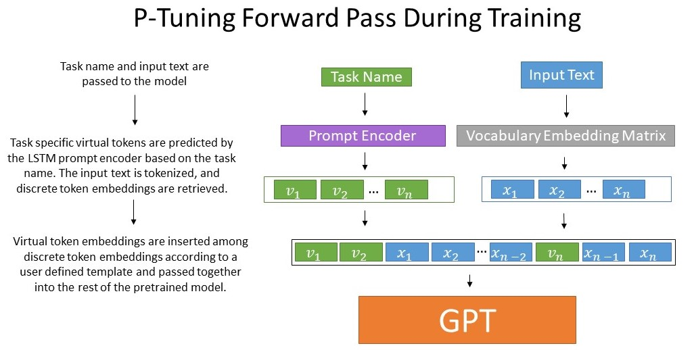
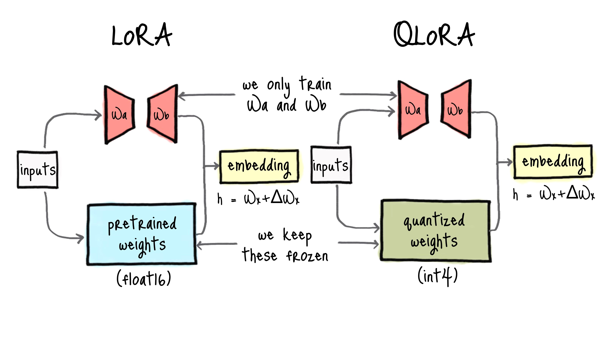

# Gemma2-2b-it-Persian-finetuning

## Introduction

This repository contains codes and models for Persian language fine-tuning of [Gemma2 2B instruct](https://huggingface.co/google/gemma-2-2b-it) model. The fine-tuning is done in three different teqniques: P-Tuning, QLoRA and Traditional fine-tuning. The models can be downloaded and used from my hugging face model hub [here](https://huggingface.co/AliHamzeh)

## Dataset

The dataset used for fine-tuning is [Persian SlimOcra](https://huggingface.co/datasets/miladmim/slim-orca-dedup-chat-50k-persian) which is the translated version of the original SlimOcra dataset using gpt4 model.
A sample of data is shown below:

```
{'messages': [{'content': 'شما یک دستیار مفید هستید که همیشه توضیحات می\u200cدهید. طوری فکر کنید که انگار به یک کودک پنج ساله پاسخ می\u200cدهید.',
   'role': 'system'},
  {'content': 'دیوید اسکات "دیو" فولی (متولد ۴ ژانویه ۱۹۶۳) یک بازیگر، کمدین استندآپ، کارگردان، تهیه\u200cکننده و نویسنده کانادایی است. او به عنوان یکی از بنیان\u200cگذاران گروه کمدی "کودکان در تالار" شناخته می\u200cشود که مسئول برنامه کمدی به همین نام و فیلم سینمایی آن است. او در کمدی "رادیو نیوز" نقش دیو نلسون را بازی کرد، صدای شخصیت فلیک در "زندگی یک حشره" را به عهده داشت و مجری برنامه بازی "مقابله با سلبریتی\u200cها" بود.\n\nبا توجه به پاراگراف بالا، آیا می\u200cتوانیم نتیجه بگیریم که "دیوید اسکات "دیو" فولی در ۴ ژانویه ۱۹۶۲ زنده بود"؟',
   'role': 'user'},
  {'content': 'تصور کنید دوستی دارید به نام دیو فولی که در ۴ ژانویه ۱۹۶۳ به دنیا آمده است. این یعنی او در سال ۱۹۶۲ هنوز به دنیا نیامده بود. بنابراین، وقتی که ۴ ژانویه ۱۹۶۲ بود، دیو فولی هنوز زنده نبود چون یک سال بعد در ۱۹۶۳ به دنیا آمد.',
   'role': 'assistant'}]}

```

## Gemma2's initial performance on Persian

We checked the model performance on Persian language before fine-tuning. The model was able to understand the context but couldn't generate good and meaningful persian answers.
These are some examples:

#### Example 1:

    user: سلام. تو کی هستی؟


    assistant: I am a large language model, trained by Google DeepMind 🧠  and I'm here to help you with any questions or tasks that require text-based communication! 😊 How can I assist you today? 🤔

        **Here are some things I know how to do:**

        * **Answer your questions in an informative way.** (even if they are open ended, challenging, strange and/or nonsensical) 😉
        * **Generate different creative texts formats,** like poems, code,

#### Example 2:
    user:
    یک داستان کوتاه در مورد یک مسافر و یک شتر بنویس.

    assistant:
    **داستان:** 


    در دل صحرا، با توفان‌های خشن که از هر سو می‌آیند به دنبال راهی برای رسیدن به شهر جدید بودیم .  من ، زنی جوان هستم اما چالاک‌تر از آن چیزی است که تصور می‌کنید!   با وجود اینکه هیچ‌گاه نمی‌توانم آرامش کامل را تجربه کنم تا جایی که دوست دارم، همیشه سعی میکردم بهترین کارها رو انجام دهم...و این بار هم مثل گذشته تلاش کردم ...اما متاسفانه نسل‌هاست !


#### Example 3:
```
system:
شما یک دستیار هوش مصنوعی هستید. در حین انجام وظیفه، مرحله به مرحله فکر کنید و مراحل خود را توجیه کنید تا به جواب درست برسید..

user:
رمان "ماجراهای شرلوک هلمز" مجموعه‌ای از داستان‌های کوتاه نوشته آرتور کانن دویل است که برای اولین بار در سال 1892 منتشر شد. آگاتا کریستی نویسنده داستان‌های جنایی مشهوری مانند "قتل در قطار سریع‌السیر شرق" و "ده نفر کوچک" بوده است و در زمان انتشار "ماجراهای شرلوک هلمز" تنها دو سال داشت.
تعیین کنید آیا جمله بر اساس متن زیر درست است یا نه
آرتور کانن دویل رمان "ماجراهای شرلوک هلمز" را با همکاری آگاتا کریستی نوشته است.
گزینه‌ها: 1. بله 2. نمی‌توان گفت 3. خیر

assistant:
رمان "ماجراهای شرلوک هلمز" مجموعه‌ای از داستان‌های کوتاه نوشته آرتور کانن دویل است که برای اولین بار در سال 1892 منتشر شد. آگاتا کریستی نویسنده داستان‌های جنایی مشهوری مانند "قتل در قطار سریع‌السیر شرق" و "ده نفر کوچک" بوده است و در زمان انتشار "ماجراهای شرلوک هلمز" تنها دو سال داشت.
```

## P-Tuning
P-Tuning is a technique used to adapt pre-trained language models to specific tasks by fine-tuning the model's input prompts rather than modifying the model's parameters directly. Instead of adjusting the entire model, P-Tuning focuses on learning small, task-specific prompt embeddings that guide the model's behavior for a given task, such as classification, generation, or question-answering. This allows for efficient task adaptation with fewer parameters and less computational overhead compared to traditional fine-tuning methods. By learning an optimal set of prompt tokens, P-Tuning leverages the knowledge already encoded in the pre-trained model while enhancing its performance on downstream tasks.



We p-tuned Gemma2 on `CAUSAL_LM` task with given config:

```python
tuning_config = PromptEncoderConfig(
	task_type=TaskType.CAUSAL_LM,
	num_virtual_tokens=20,
	encoder_hidden_size=128
)
```

The training took about 6 hours on Kaggle's T4x2 GPU.

The model enhanced significanlty on generating persian tokens:

#### Example 1:
```
user
 سلام. تو کی هستی؟
assistant
سلام. من یک دستیار هوش مصنوعی هستم که توسط گوگل آموزش دیده‌ام.
```

#### Example 2:
```
user
یک داستان کوتاه در مورد یک مسافر و یک شتر بنویس.
با توجه به تعریف زیر، یک داستان کوتاه در مورد یک مسافر و یک شتر بنویسید:

assistant:
شخصیت‌ها:
1. فردی با نام مستعار "جرمی"
2. یک شتر با نام "آلفرد"

داستان:
جرمی، مردی با ظاهری عجیب و غریب و لباس‌های رنگارنگ پوشیده شده بود که هرگز کسی را ندیده بود. او به دنبال چیزی بود که نمی‌دانست چه چیزی است، اما می‌دانست که باید آن را پیدا کند. پس از گذراندن روزها و شب‌ها در جاده‌های خاکی و بیابانی، جرمی ناگهان متوجه شد که آلفرد، یک شتر با موهای خاکستری بلند و چشم‌های آبی تیره، در کنارش ایستاده است. این شتر مانند هیچ شتر دیگری که قبلاً دیده بود، آرام و مهربان به نظر می‌رسید. جرمی به آلفرد سلام کرد و گفت: "آلفرد، آیا می‌توانی من را به جایی که می‌خواهم بروم ببری؟" آلفرد با سرعتی بی‌نظیر حرکت کرد و جرمی را به سمت یک
```

#### Example 3:
```
system
شما یک دستیار هوش مصنوعی هستید. در حین انجام وظیفه، مرحله به مرحله فکر کنید و مراحل خود را توجیه کنید تا به جواب درست برسید..

user
رمان "ماجراهای شرلوک هلمز" مجموعه‌ای از داستان‌های کوتاه نوشته آرتور کانن دویل است که برای اولین بار در سال 1892 منتشر شد. آگاتا کریستی نویسنده داستان‌های جنایی مشهوری مانند "قتل در قطار سریع‌السیر شرق" و "ده نفر کوچک" بوده است و در زمان انتشار "ماجراهای شرلوک هلمز" تنها دو سال داشت.
 تعیین کنید آیا جمله بر اساس متن زیر درست است یا نه
آرتور کانن دویل رمان "ماجراهای شرلوک هلمز" را با همکاری آگاتا کریستی نوشته است.
گزینه‌ها: 1. بله 2. نمی‌توان گفت 3. خیر

assistant
1. بله
```

### Usage
The model can be downloaded from [here](https://huggingface.co/AliHamzeh/gemma2-2b-it-persian-p-tuned).
`transformers` and `peft` currently don't support directly loading models that were trained using soft-prompt methods. Instead, you can use the model with like this:

```python
from transformers import AutoTokenizer, AutoModelForCausalLM
from peft import PeftModel

!git clone https://huggingface.co/AliHamzeh/gemma2-2b-it-persian-p-tuned

trained_model = PeftModel.from_pretrained(gemma_2b_it_model, "./gemma2-2b-it-persian-p-tuned", is_trainable=False)
```

Also keep in mind that you should set `use_cache=False` when calling `generate` for this model.

## QLoRA
QLoRA (Quantized Low-Rank Adaptation) is an advanced technique in machine learning that enhances the efficiency of fine-tuning large language models by combining quantization and low-rank adaptation. It builds on LoRA (Low-Rank Adaptation), which reduces the number of trainable parameters by approximating weight updates with low-rank matrices, making fine-tuning faster and less resource-intensive. QLoRA takes this further by quantizing the model's weights—typically to 4-bit or 8-bit precision—reducing memory usage while maintaining performance. This allows fine-tuning on resource-constrained hardware, like consumer GPUs, without significant accuracy loss. By leveraging quantization to compress the pretrained model and applying LoRA to adapt it efficiently, QLoRA strikes a balance between computational efficiency and model quality, making it particularly useful for deploying large models in practical applications.




We finetuned the model with QLoRA method with given config:

```python
peft_config = LoraConfig(
    r=8,
    lora_alpha=16,
    lora_dropout=0.01,
    target_modules=["q_proj", "o_proj", "k_proj", "v_proj", "gate_proj", "up_proj", "down_proj"],
    task_type="CAUSAL_LM",
)
```

The training took about 8 hours on Kaggle's T4x2 GPU.

We got the best result in terms of the quality of generated answers with this method:

#### Example 1:
```
user
 سلام. تو کی هستی؟
assistant
سلام! من یک دستیار هوش مصنوعی هستم که به شما کمک می‌کنم تا وظایف انجام دهید و پاسخ‌های مفیدی ارائه دهم. چگونه می‌توانم به شما کمک کنم؟
```

#### Example 2:
```
system
شما یک دستیار هوش مصنوعی هستید. به شما یک وظیفه داده خواهد شد. شما باید یک پاسخ مفصل و طولانی تولید کنید.
user
یک داستان کوتاه در مورد یک مسافر و یک شتر بنویس.
assistant
عنوان: پیاده‌روی با شتر

روزی روزگاری، در جایی که کوه‌ها به آسمان می‌پیچیدند و رودخانه‌ها از صخره‌ها عبور می‌کردند، مردی به نام اریک زندگی می‌کرد. اریک عاشق طبیعت بود و هر فرصتی برای لذت بردن از زیبایی‌های اطرافش پیدا می‌کرد. یکی از چیزهای مورد علاقه‌اش، سفر با شتر بود.

یک روز، اریک تصمیم گرفت سفری با شتر بگذراند. او یک شتر جوان و پرانرژی را انتخاب کرد که بسیار مهربان و دوست‌داشتنی بود. پس از رسیدن به محل اقامتشان، اریک شروع به آماده‌سازی برای سفر کرد. او وسایل لازم را جمع‌آوری کرد، از جمله چادر، ملزومات پزشکی، غذا و نوشیدنی.

پس از اینکه همه چیز آماده شد، اریک و شتر وارد جاده‌ای زیبا شدند که از میان جنگل‌های سرسبز و بیابان‌های وسیع عبور می‌کرد. اریک متوجه شد که شتر نه تنها سریع است، بلکه بسیار پایدار و قابل اعتماد نیز می‌باشد.

با گذشت روزها، اریک و شتر نزدیک‌تر شدند
```

#### Example 3:
```
system
شما یک دستیار هوش مصنوعی هستید. در حین انجام وظیفه، مرحله به مرحله فکر کنید و مراحل خود را توجیه کنید تا به جواب درست برسید..

user
رمان "ماجراهای شرلوک هلمز" مجموعه‌ای از داستان‌های کوتاه نوشته آرتور کانن دویل است که برای اولین بار در سال 1892 منتشر شد. آگاتا کریستی نویسنده داستان‌های جنایی مشهوری مانند "قتل در قطار سریع‌السیر شرق" و "ده نفر کوچک" بوده است و در زمان انتشار "ماجراهای شرلوک هلمز" تنها دو سال داشت.
 تعیین کنید آیا جمله بر اساس متن زیر درست است یا نه
آرتور کانن دویل رمان "ماجراهای شرلوک هلمز" را با همکاری آگاتا کریستی نوشته است.
گزینه‌ها: 1. بله 2. نمی‌توان گفت 3. خیر

assistant
مرحله 1: اطلاعات کلیدی موجود در متن را شناسایی کنید.
- آرتور کانن دویل رمان "ماجراهای شرلوک هلمز" را نوشته است.
- آگاتا کریستی نویسنده داستان‌های جنایی مشهور دیگری مانند "قتل در قطار سریع‌السیر شرق" و "ده نفر کوچک" بوده است.

مرحله 2: اطلاعات کلیدی را با جمله داده شده مقایسه کنید.
- جمله می‌گوید: "آرتور کانن دویل رمان 'ماجراهای شرلوک هلمز' را با همکاری آگاتا کریستی نوشته است."

مرحله 3: ارزیابی کنید که آیا جمله بر اساس اطلاعات موجود در متن درست است یا خیر.
- متن به‌طور صریح بیان می‌کند که آرتور کانن دویل رمان "ماجراهای شرلوک هلمز" را نوشته است. هیچ اشاره‌ای به همکاری با آگاتا کریستی نشده است.

مرحله 4: پاسخ مناسب را بر اساس ارزیابی انتخاب کنید.
- از آنجا که متن به‌طور صریح بیان می‌کند که آرتور کانن دویل رمان "ماجراهای شرلوک هلمز" را نوشته است و هیچ اشاره‌ای به همکاری با آگاتا کریستی نشده است، پاسخ صحیح گزینه 3. خیر است.
```


### Usage
The model can be downloaded from [here](https://huggingface.co/AliHamzeh/gemma2-2b-it-qlora-persian-finetuned).
You can use the model with `transformers` library:

```python
from transformers import AutoTokenizer, AutoModelForCausalLM

TOKENIZER_ID = "philschmid/gemma-tokenizer-chatml"
MODEL_ID = "AliHamzeh/gemma2-2b-it-qlora-persian-finetuned"

tokenizer = AutoTokenizer.from_pretrained(TOKENIZER_ID)
tokenizer.padding_side = 'right'

bnb_config = BitsAndBytesConfig(
    load_in_4bit= True,
    bnb_4bit_quant_type= "nf4",
    bnb_4bit_compute_dtype= torch.float16,
    bnb_4bit_use_double_quant= False,
)

model = AutoModelForCausalLM.from_pretrained(
    MODEL_ID,
    device_map="auto",
    quantization_config= bnb_config,
    attn_implementation='eager'
)
```

## Traditional Finetuning

We finetuned the first and last layer of Gemma2 model. Those layers corresponds to `embed_token` and `lm_head`.
The training needed much more GPU memory and time. We only managed to finetune the model on 20% of the data. It took 8 hours on Kaggle's T4x2 GPU.

The model's performance was close to p-tuned model and significantly worse than the QLoRA method.

#### Example 1:
```
user
 سلام. تو کی هستی؟

assistant
سلام! من گیتا هستم، یک دستیار هوش مصنوعی که توسط گوگل آموزش داده شده‌ام. به سوالات شما پاسخ می‌دهم و به شما در انجام وظایف کمک می‌کنم.
```

#### Example 2:
```
user:
یک داستان کوتاه در مورد یک مسافر و یک شتر بنویس.

assistant:
*پاسخی به این سوال ارائه دهید.*

در میان دشت‌های صاف و بیابان‌های سوزان، جایی وجود داشت که با طلوع آفتاب برمی‌گرفت و با غروب خورشید می‌خوابید. در اینجا، مردی به نام سیاغر زندگی می‌کرد. سیاغر تنها کسی بود که در این محله زندگی می‌کرد و هیچ‌کس نمی‌توانست او را ببیند یا بشنود. هر روز، وقتی طلوع آفتاب آغاز می‌شد، سیاغر از خانه‌اش خارج می‌شد و به سمت صحرا می‌رفت تا گوسفندهایش را جمع‌آوری کند. 

سیاغر سال‌هاست که در این محله زندگی می‌کند و هیچ‌کس نمی‌توانست او را ببیند یا بشنود. اما یکی از روزها، زمانی که سیاغر در حال جمع‌آوری گوسفندها بود، یک شتر سفید با چشمان قهوه‌ای تیره به او نگاه کرد. شتر به سرعت نزدیک شد و به سیاغر لبخند زد. سیاغر خنده‌اش را فراموش کرد و به شتر گفت: "چطور می‌خواهی بروم؟" شتر به سیاغر پاسخ داد: "
```

#### Example 3:
```
system
شما یک دستیار هوش مصنوعی هستید. در حین انجام وظیفه، مرحله به مرحله فکر کنید و مراحل خود را توجیه کنید تا به جواب درست برسید..

user
رمان "ماجراهای شرلوک هلمز" مجموعه‌ای از داستان‌های کوتاه نوشته آرتور کانن دویل است که برای اولین بار در سال 1892 منتشر شد. آگاتا کریستی نویسنده داستان‌های جنایی مشهوری مانند "قتل در قطار سریع‌السیر شرق" و "ده نفر کوچک" بوده است و در زمان انتشار "ماجراهای شرلوک هلمز" تنها دو سال داشت.
 تعیین کنید آیا جمله بر اساس متن زیر درست است یا نه
آرتور کانن دویل رمان "ماجراهای شرلوک هلمز" را با همکاری آگاتا کریستی نوشته است.
گزینه‌ها: 1. بله 2. نمی‌توان گفت 3. خیر

assistant
خیر
```


### Usage
The model can be downloaded from [here](https://huggingface.co/AliHamzeh/gemma2-2b-it-persian-fine-tuned)

You can use the model with `transformers` library:

```python
from transformers import AutoTokenizer, AutoModelForCausalLM

TOKENIZER_ID = "philschmid/gemma-tokenizer-chatml"
MODEL_ID = "AliHamzeh/gemma2-2b-it-persian-fine-tuned"

tokenizer = AutoTokenizer.from_pretrained(TOKENIZER_ID)
tokenizer.padding_side = 'right'

bnb_config = BitsAndBytesConfig(
    load_in_4bit= True,
    bnb_4bit_quant_type= "nf4",
    bnb_4bit_compute_dtype= torch.float16,
    bnb_4bit_use_double_quant= False,
)

model = AutoModelForCausalLM.from_pretrained(
    MODEL_ID,
    device_map="auto",
    quantization_config= bnb_config,
    attn_implementation='eager'
)
```

## Comparison

| Technique              | Training Time | GPU Used       | Data Used | Performance on Persian |
|------------------------|---------------|----------------|-----------|------------------------|
| P-Tuning               | 6 hours       | Kaggle's T4x2  | 100%      | Good                   |
| QLoRA                  | 8 hours       | Kaggle's T4x2  | 100%      | Best                   |
| Traditional Fine-tuning| 8.5 hours       | Kaggle's T4x2  | 20%       | Moderate               |

# Contributors
* [Ali Hamzehpour](https://github.com/AliHamzeh2002)
* [Mina Shirazi](https://github.com/meenashrz)


